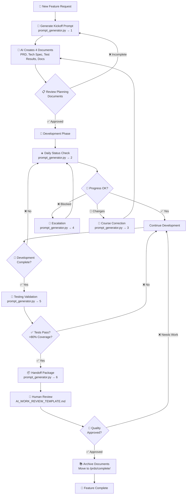
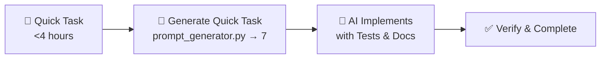
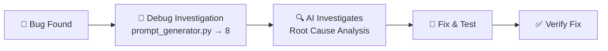

# 🔄 AI Development Workflow Diagram

## 📊 Complete Workflow Overview



## 🔀 Quick Task Workflow



## 🐛 Debug Workflow



## 📁 Document Flow

```
┌─────────────────────────────────────────────────────────┐
│                    PROJECT START                         │
├─────────────────────────────────────────────────────────┤
│                        ↓                                 │
│    /prds/active/                                        │
│    ├── FEATURE_PRD.md         (Status: DRAFT)          │
│    ├── FEATURE_TECH_SPEC.md   (Status: DRAFT)          │
│    ├── FEATURE_TEST_RESULTS.md (Status: NOT_STARTED)    │
│    └── FEATURE_DOCS.md        (Status: DRAFT)          │
│                        ↓                                 │
│                  DURING DEVELOPMENT                      │
│                        ↓                                 │
│    Status Updates:                                       │
│    - PRD → APPROVED                                      │
│    - Tech Spec → APPROVED → IN_DEVELOPMENT             │
│    - Test Results → IN_PROGRESS                         │
│    - Docs → IN_PROGRESS                                 │
│                        ↓                                 │
│                  AFTER COMPLETION                        │
│                        ↓                                 │
│    /prds/complete/                                      │
│    ├── FEATURE_PRD.md         (Status: COMPLETE)       │
│    ├── FEATURE_TECH_SPEC.md   (Status: IMPLEMENTED)    │
│    ├── FEATURE_TEST_RESULTS.md (Status: COMPLETE)       │
│    └── FEATURE_DOCS.md        (Status: PUBLISHED)      │
└─────────────────────────────────────────────────────────┘
```

## 🚦 Quality Gates Detail

```
┌──────────────────┐     ┌──────────────────┐     ┌──────────────────┐
│ PLANNING GATE    │     │ DEVELOPMENT GATE │     │ DEPLOYMENT GATE  │
├──────────────────┤     ├──────────────────┤     ├──────────────────┤
│ ✓ PRD Complete   │     │ ✓ Code Complete  │     │ ✓ Tests Pass     │
│ ✓ Tech Spec Done │ --> │ ✓ Tests >80%     │ --> │ ✓ Perf Met       │
│ ✓ Risks Assessed │     │ ✓ Docs Updated   │     │ ✓ Security OK    │
│ ✓ Tasks Defined  │     │ ✓ Review Done    │     │ ✓ Docs Final     │
└──────────────────┘     └──────────────────┘     └──────────────────┘
         ↓                        ↓                        ↓
    CAN START DEV           CAN START TEST           CAN DEPLOY
```

## 🎯 Prompt Selection Matrix

| Situation | Current Phase | Use Prompt | Next Step |
|-----------|---------------|------------|-----------|
| Starting new work | Pre-planning | #1 Kickoff | Create 4 docs |
| Morning standup | Development | #2 Status | Review progress |
| Requirements changed | Any phase | #3 Correction | Update docs |
| Can't proceed | Any phase | #4 Blocked | Get help |
| Code complete | Development | #5 Testing | Validate tests |
| All tests pass | Testing | #6 Handoff | Package delivery |
| Small bug/feature | Any time | #7 Quick | Fast track |
| Something broken | Any time | #8 Debug | Investigate |
| Too slow | Post-dev | #9 Performance | Optimize |
| PR ready | Pre-merge | #10 Review | Quality check |

## 🔄 Daily Rhythm

```
Morning (9 AM)
    ↓
📊 Status Check (Prompt #2)
    ↓
🔧 Development Work
    ↓
🚧 Hit Blocker? → Use Prompt #4
    ↓
📝 Update Docs Throughout Day
    ↓
🌙 End of Day → Commit & Push
    ↓
Repeat Until Complete
```

## 📈 Success Indicators

```
Week 1: Planning Heavy
[████████░░░░░░░░░░░░] 40% Docs, 60% Planning

Week 2-3: Development
[████████████████░░░░] 80% Code, 20% Docs

Week 4: Testing & Polish  
[██████████████████░░] 90% Tests, 10% Final Docs

Ready to Ship! 
[████████████████████] 100% Complete
```

---

**Key**: Every arrow in these diagrams should have evidence (test outputs, metrics, documentation) before proceeding to the next step!