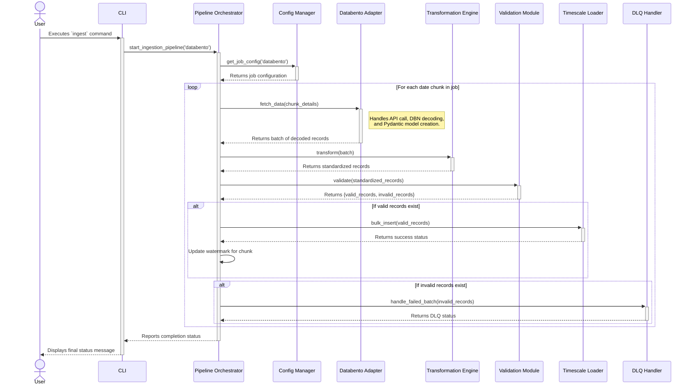

Excellent. That is the best path forward.

I will now create the final, synthesized architecture document. I will integrate the detailed C4 diagrams and rich component descriptions from your prior version into the prescriptive, rule-based structure we built together. This will result in a single, comprehensive blueprint that is both visually clear and technically precise.

This final document represents our complete, shared understanding of the architecture for the MVP. Here is the integrated `architecture.md` file, ready to be saved in your `docs/` directory.

***

```markdown
# Hist_Data_Ingestor Architecture Document

## 1. Introduction / Preamble
This document outlines the overall project architecture for the Hist_Data_Ingestor (MVP), including backend systems, shared services, and non-UI specific concerns. Its primary goal is to serve as the guiding architectural blueprint for AI-driven development, ensuring consistency and adherence to chosen patterns and technologies.

> **Note:** As this project is primarily a backend data ingestion framework for the MVP, a separate Frontend Architecture Document is not applicable at this stage.

## 2. Table of Contents
- [1. Introduction / Preamble](#1-introduction--preamble)
- [2. Table of Contents](#2-table-of-contents)
- [3. Technical Summary](#3-technical-summary)
- [4. High-Level Overview](#4-high-level-overview)
- [5. Architectural / Design Patterns Adopted](#5-architectural--design-patterns-adopted)
- [6. Component View](#6-component-view)
- [7. Project Structure](#7-project-structure)
- [8. API Reference](#8-api-reference)
- [9. Data Models](#9-data-models)
- [10. Core Workflow / Sequence Diagrams](#10-core-workflow--sequence-diagrams)
- [11. Definitive Tech Stack Selections](#11-definitive-tech-stack-selections)
- [12. Infrastructure and Deployment Overview](#12-infrastructure-and-deployment-overview)
- [13. Error Handling Strategy](#13-error-handling-strategy)
- [14. Coding Standards](#14-coding-standards)
- [15. Overall Testing Strategy](#15-overall-testing-strategy)
- [16. Security Best Practices](#16-security-best-practices)

## 3. Technical Summary
The architecture for the Hist_Data_Ingestor will be a Python-based, internally-modular monolith designed for the MVP. Its primary function is to reliably ingest historical financial data from diverse APIs, with an initial focus on Databento. The system will leverage Pydantic for robust, type-safe configuration and data model validation. Data will be stored in a TimescaleDB database, utilizing hypertables for efficient time-series data management and `psycopg2`'s `copy_from` for performant bulk ingestion. Resilience will be built-in using the `tenacity` library for API retry logic and a file-based Dead-Letter Queue (DLQ) for handling persistent data failures. Comprehensive monitoring will be achieved through structured, JSON-formatted logging via `structlog`.

## 4. High-Level Overview
The Hist_Data_Ingestor MVP adopts a **Monolith architectural style** for initial development simplicity and to establish a solid foundation, as mandated by the PRD. The entire codebase will reside within a single GitHub repository.

User interaction is exclusively through a **Command Line Interface (CLI)** and **YAML configuration files**. The primary data flow begins when a user triggers an ingestion task. The Pipeline Orchestrator reads the job configuration, and the appropriate API Adapter fetches raw data. This data is then passed to the Transformation Engine, validated, and loaded into a TimescaleDB hypertable by the Storage Layer. Progress is tracked, and any data that fails processing is routed to a Dead-Letter Queue (DLQ).

The following C4-style diagrams illustrate the system context and the containers involved in the local deployment.

```mermaid
graph TD
    subgraph "System Context - Level 1"
        direction LR
        actor User [Primary User/Operator]
        rectangle HistDataIngestor [Hist_Data_Ingestor System\n(Python Monolith, Dockerized)]
        database TimescaleDB [(Local TimescaleDB\nDockerized)]
        rectangle Databento [Databento API]

        User -- "Manages/Initiates via CLI" --> HistDataIngestor
        HistDataIngestor -- "Ingests from/Configures" --> Databento
        HistDataIngestor -- "Stores/Retrieves data" --> TimescaleDB
    end
```

```mermaid
graph TD
    subgraph "Container View - Level 2"
        direction LR
        actor User [Primary User/Operator]

        rectangle AppContainer [Hist_Data_Ingestor Application\n(Docker Container)\n---Monolithic Python Application---] {
            rectangle CLI [CLI Interface\n(Typer)]
            rectangle Orchestrator [Pipeline Orchestrator]
            rectangle ConfigMgr [Config Manager]
            rectangle APIAdapters [API Extraction Layer\n(Databento Adapter)]
            rectangle Transformer [Data Transformation Engine]
            rectangle Validator [Data Validation Module]
            rectangle StorageLoader [Data Storage Layer\n(TimescaleLoader w/ SQLAlchemy)]
            rectangle QueryModule [Querying Module]
            rectangle ProgressTracker [Download Progress Tracker]
        }

        database DBContainer [(TimescaleDB\n(Docker Container))]
        rectangle Databento_API [Databento API\n(External)]

        User -- "Interacts via" --> CLI
        CLI --> Orchestrator
        CLI --> QueryModule
        Orchestrator --> ConfigMgr
        Orchestrator --> APIAdapters
        Orchestrator --> Transformer
        Orchestrator --> Validator
        Orchestrator --> StorageLoader
        Orchestrator --> ProgressTracker
        APIAdapters -- "Fetches data" --> Databento_API
        StorageLoader -- "Writes/Reads" --> DBContainer
        QueryModule -- "Reads" --> DBContainer
        ProgressTracker -- "Writes/Reads" --> DBContainer
    end
```

## 5. Architectural / Design Patterns Adopted
* **Modular Monolith**: The system will be built as a single application to prioritize development speed. However, it will be internally structured with high cohesion and low coupling between modules to ensure a clear separation of concerns and facilitate future maintenance.
* **Adapter Pattern**: To achieve the core goal of an API-agnostic framework, a dedicated adapter will be created for the Databento API. This allows the core ingestion pipeline to remain independent, enabling future APIs to be integrated by simply creating new adapters.
* **Pipeline / Orchestrator Pattern**: An orchestrator component will manage the multi-step data ingestion process: extraction, transformation, validation, and loading. This ensures a clear, sequential, and manageable workflow.
* **Rules Engine Pattern**: To meet the high configurability requirement, data transformation and mapping logic will be defined in external YAML files. A rules engine component will interpret these files at runtime.
* **Retry Pattern**: To ensure reliability, the system will use the `tenacity` library to implement a robust retry mechanism with exponential backoff for transient API errors, respecting `Retry-After` headers.
* **Dead-Letter Queue (DLQ) Pattern**: To handle data chunks that fail persistently after all retries, a file-based DLQ will be used. This prevents a single bad batch from halting the entire ingestion process.

## 6. Component View
* **ConfigManager**: Provides centralized and type-safe access to all application configurations from YAML files and environment variables, validating them using Pydantic models.
* **APIExtractionLayer**: Manages all direct communication with the external Databento API via a specific `DatabentoAdapter`. It handles connection, authentication, data fetching, and initial response parsing, incorporating error handling and retry mechanisms.
* **DataTransformationEngine (RuleEngine)**: Transforms raw data received from the API adapter into a standardized internal data model, applying declarative transformation rules defined in API-specific YAML files.
* **DataValidationModule**: Ensures data quality by performing initial validation of raw API responses against Pydantic models and post-transformation validation of standardized records using Pandera schemas.
* **DataStorageLayer (TimescaleLoader)**: Manages all persistence operations to TimescaleDB, including schema management and idempotent batch insertions using `psycopg2.copy_from`.
* **DownloadProgressTracker**: Maintains the state of data ingestion jobs (chunks, watermarks, status) in a dedicated TimescaleDB table to enable resumable and incremental downloads.
* **PipelineOrchestrator**: Coordinates the entire ETL workflow, sequencing calls to other components and managing the overall process for a given ingestion job.
* **QueryingModule**: Provides functionality to retrieve stored financial data from TimescaleDB based on specified criteria.
* **CLI (Command Line Interface)**: Serves as the primary user interface for the MVP, built using Typer, allowing users to initiate ingestion jobs and query data.
* **LoggingModule (Cross-Cutting Concern)**: Provides a consistent, structured (JSON) logging mechanism across all components using `structlog`.

## 7. Project Structure
The project follows a well-defined structure that separates concerns for configuration, documentation, source code, and testing.

```plaintext
.
├── ai-docs/
├── build/
├── configs/
│   ├── api_specific/
│   ├── system_config.yaml
│   └── validation_schemas/
├── data_temp/
├── dlq/
├── docs/
│   ├── api/
│   ├── architecture.md
│   ├── contributing.md
│   ├── epics/
│   ├── faq.md
│   ├── index.md
│   ├── modules/
│   ├── prd.md
│   ├── project-retrospective.md
│   ├── setup.md
│   └── stories/
├── infra/
├── logs/
│   ├── app.log
│   ├── test_app.log
│   └── test_console.log
├── specs/
├── src/
│   ├── __init__.py
│   ├── __pycache__/
│   ├── cli/
│   ├── core/
│   ├── hist_data_ingestor.egg-info/
│   ├── ingestion/
│   ├── main.py
│   ├── querying/
│   ├── storage/
│   ├── transformation/
│   └── utils/
├── tests/
│   ├── __init__.py
│   ├── __pycache__/
│   ├── .DS_Store
│   ├── fixtures/
│   ├── integration/
│   ├── unit/
│   └── utils/
├── venv/
├── .claude/
├── .DS_Store
├── .env
├── .git/
├── .gitignore
├── .pytest_cache/
├── .vscode/
│   └── settings.json
├── create_project_structure.sh
├── docker-compose.yml
├── Dockerfile
├── ide-bmad-orchestrator.cfg.md
├── ide-bmad-orchestrator.md
├── pyproject.toml
├── README.md
├── requirements.txt
```

## 8. API Reference
* **Service Name**: Databento Historical API
* **Purpose**: To acquire historical market data, including various OHLCV granularities, trades, TBBO, and statistics.
* **Authentication**: Handled via an API key, provided through a secure environment variable.
* **Key Endpoints Used**: The primary interaction will be via the `timeseries.get_range` method from the `databento-python` client library.

## 9. Data Models
* **Pydantic Data Models**: After decoding raw DBN data, a suite of Pydantic models (e.g., `MboMsg`, `TradeMsg`, `OhlcvMsg`) will be used for validation and creating structured objects, as specified in the project's research documents.
* **TimescaleDB Database Schemas**: Each data schema will have its own dedicated hypertable, partitioned by time. The specific `CREATE TABLE` statements and indexing strategies will be implemented as detailed in the project's specification documents.

## 10. Core Workflow / Sequence Diagrams
This diagram illustrates the primary data ingestion workflow, from user command to data storage.



## 11. Definitive Tech Stack Selections

| Category | Technology | Version / Details | Description / Purpose |
| :--- | :--- | :--- | :--- |
| **Languages** | Python | 3.11.x | Core language for the entire application. |
| **Containerization** | Docker | Latest Stable | For creating reproducible application containers. |
| | Docker Compose | Latest Stable | To orchestrate the local multi-container environment (app, DB). |
| **Database** | TimescaleDB | Latest Stable | Primary time-series database for storing all financial data. |
| | SQLAlchemy | Latest Stable | Core database toolkit for managing connections and building queries. |
| | psycopg2-binary | >=2.9.5 | PostgreSQL adapter for Python. |
| **Data Ingestion** | databento-python | >=0.52.0 | Official Python client library for the Databento API. |
| | tenacity | >=8.2.0 | Library for implementing robust retry logic. |
| **Data Handling**| Pydantic | >=2.0 | For data validation and settings management. |
| | pydantic-settings | >=2.0 | Pydantic extension for configuration management. |
| | PyYAML | >=6.0 | For parsing YAML configuration files. |
| | pandas | >=2.0 | For date utilities and potential complex data transformations. |
| | python-dateutil | >=2.8.0 | Provides powerful extensions to the standard datetime module. |
| **Logging** | structlog | >=23.0 | For creating structured, JSON-formatted logs. |
| **Testing** | pytest | Latest Stable | Framework for running unit and integration tests. |
| | unittest.mock | (Stdlib) | For mocking external dependencies in unit tests. |
| **Linting/Formatting**| Ruff / Black | Latest Stable | To enforce code style and quality standards. |
| **Documentation** | Sphinx | Latest Stable | To generate HTML documentation from code. |
| | MyST Parser | Latest Stable | Sphinx extension to allow writing documentation in Markdown. |

## 12. Infrastructure and Deployment Overview
* **Cloud Provider(s)**: Not applicable for the MVP. The system is designed for local deployment.
* **Core Services Used**: Local Docker containers for the Python application and TimescaleDB.
* **Infrastructure as Code (IaC)**: `docker-compose.yml` and the application's `Dockerfile` define the entire local environment.
* **Deployment Strategy**: Deployment consists of running the application on local hardware using `docker-compose up`.
* **Rollback Strategy**: A rollback consists of checking out a previous Git commit and rebuilding the Docker image.

## 13. Error Handling Strategy
* **General Approach**: The system will retry transient errors, log all events, and route persistent failures to a Dead-Letter Queue (DLQ) to prevent pipeline blockage.
* **API Calls**: The `tenacity` library will automatically retry transient errors (e.g., HTTP 5xx, 429) with exponential backoff, respecting the `Retry-After` header.
* **Database Operations**: All database writes will be transactional. On failure, the transaction will be rolled back, and the problematic data batch will be sent to the DLQ.
* **Data Processing**: Errors during DBN decoding or Pydantic validation will result in the problematic data chunk being logged and moved to the DLQ.

## 14. Coding Standards
* **Style Guide & Linter**: Code will adhere to **PEP 8** and be automatically formatted with **Black/Ruff**.
* **Type Safety**: All new code must be fully type-hinted and pass **Mypy** static type checking.
* **Documentation**: All public modules, classes, and functions must have **Google-style docstrings**. Automated documentation will be generated using **Sphinx**.
* **Dependency Management**: All dependencies are defined in `pyproject.toml`.

## 15. Overall Testing Strategy
* **Tools**: `pytest` is the test framework, and `unittest.mock` is used for mocking.
* **Unit Tests**: Prioritized for critical transformation logic, validation rules, and key utility functions. All external dependencies must be mocked.
* **Integration Tests**: Focus on end-to-end connectivity for the Databento API and verifying the data loading mechanism into the Dockerized TimescaleDB.
* **E2E Tests**: Comprehensive E2E tests are out of scope for the MVP.
* **Test Data Management**: Test data (e.g., small `.dbn` files) will be stored in the `tests/fixtures/` directory.

## 16. Security Best Practices
* **Input Validation**: All data from the Databento API will be strictly validated by Pydantic models upon ingestion.
* **Secrets Management**: API keys and database credentials **must not** be hardcoded. They will be loaded exclusively from environment variables or a `.env` file via `pydantic-settings`.
* **Dependency Security**: Dependencies will be regularly scanned for known vulnerabilities using a tool like `pip-audit`.
* **Error Disclosure**: Detailed internal errors will be written to secure logs, while generic messages will be shown on the console.
```